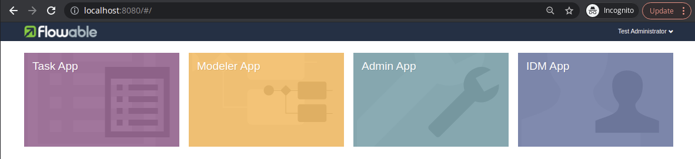

## frowable-core
This application consists of the following components:
* Flowable Engine - the BPMN engine that is running processes.
* Flowable UI IDM - the application responsible for the access control, that is also the starting point for the web applications.
* Flowable UI Task - the application that make it possible to view running instances of the processes, and to process tasks (manual tasks).
* Flowable Admin - the application responsible for engine management like changing rest endpoints for other Flowable components.
* Flowable Modeled - BPMN and DMN modeler.

Application is accessible on http://localhost:8080/

Credentials:
* admin
* test

The following view should be visible after successful authentication:

## Materials
* Delegates/Workers doc can be found [here](https://github.com/flowable/flowable-engine/blob/main/docs/docusaurus/docs/bpmn/ch07b-BPMN-Constructs.md#external-worker-task)
* [flowable-external-worker-spring-boot-starter](https://www.xt-i.com/blog/flowable-external-worker-spring-boot-starter)
